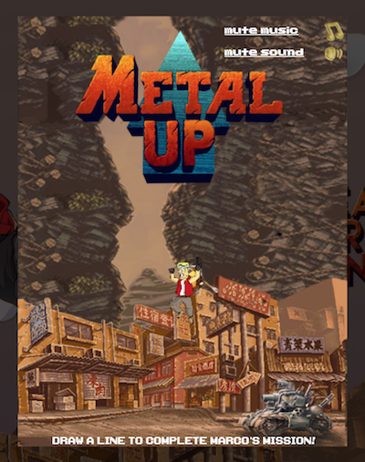

# MetalUP - READY FOR NEW ARCADE ADVENTURE?
A simple canvas-based game freely inspired to Metal Slug

## PLAY
Play here: https://gabriserra.github.io/MetalUP/

## IMPORTANT
Share buttons are written by facebook/twitter and are not correctly validated. All the other sources are 100% validated without problem (02/2014)

## GENERAL DESCRIPTION
The project was born as re-visiting of one of the most famous arcade game, Metal Slug, produced by SNK in the middle of 90s. The idea was to create a simple arcade game that can be played by all people without problem.
The game is a standalone part so can be played by all devices that have a browser and support javascript.

## WEBSITE, RANK AND OTHER PAGES
The web site and the other pages complete the game. All components are designed in retrogame style. 
The font used is the original one from SNK. Rank can be shown with two different options, show only own score or score from all players.
Signup and login are reachable from all the pages. If password is forgot, it can be re-setted with the apposite form that send an email with a random new one.

### PAGES
INDEX: Main page
SIGNUP: Signup page
ABOUT: Little guide
SCORE: Rank page

## BACKGROUND AND CHARACTER
Background is a re-elaboration of original maps, audio effects and sound are original ones.
The main character is Marco Rossi that in this mission should reach the highest number of meters.
A soldier from the army tries to stop Marco.

## TECHNICAL DETAILS
Y-axis acceleration depends on the type of jump. There are only three types of jump, the long one, the medium one and the small one. The inclination of the jump pad is used to calculate also the acceleration in X-axis and is calculated as the slope of the line drawn. In order to smooth the acceleration in the X-axis (in case for instance of slope that tend to infinity), a simple logarithm function is used.
Marco CANT pass the mid-screen coordinate, and in order to made a smooth movement, when Marco approach to the mid screen coordinate, is stopped and the background is moved.

## GAME CLASSES
AUDIO: Manage audio part
CLOCK: Define the start/stop method of game
GAME: Handle the other object and the entire game
MENU: Handle the menu above and point
PAD: Platform object
PLAYER: Player object
SKETCHER: Handle drawing on screen
SOLDIER: Enemy soldier object